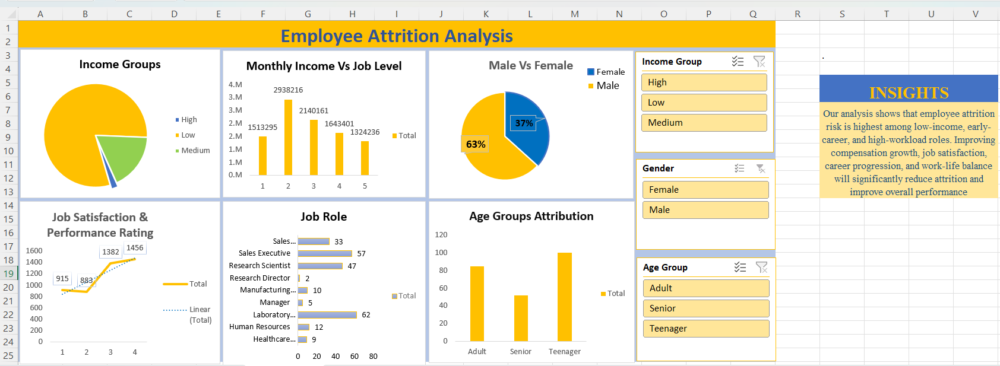

# Employee Attrition Analysis Dashboard (Excel)

## Project Overview
This project analyzes employee data to identify factors influencing attrition in an organization. The goal is to identify patterns in employee turnover and provide insights that can help HR teams improve retention strategies.

An interactive dashboard was built in Microsoft Excel to visualize key HR metrics and attrition trends.

## Tools Used
- Microsoft Excel
- Pivot Tables
- Pivot Charts
- Data Cleaning
- Dashboard Design
- Data Visualization

## Dataset Features
The dataset includes employee information such as:
- Age
- Department
- Job Role
- Monthly Income
- Job Satisfaction
- Years at Company
- Attrition Status

## Key Analysis Performed
- Attrition rate by department
- Attrition by job role
- Attrition by age group
- Salary vs attrition analysis
- Employee experience vs attrition

## Dashboard Features
The interactive dashboard includes:

- Overall Attrition Rate KPI
- Department-wise Attrition
- Job Role Attrition Distribution
- Age Group Analysis
- Salary and Experience Insights

## Key Insights
- Certain departments show higher attrition rates.
- Employees with lower tenure tend to leave more frequently.
- Salary and job satisfaction play a major role in employee retention.

## Files Included
Employee_Attrition_Analysis.xlsx – Excel workbook containing raw data, pivot tables, and a dashboard.

dashboard.png – Screenshot of the final dashboard.

## Dashboard Preview

